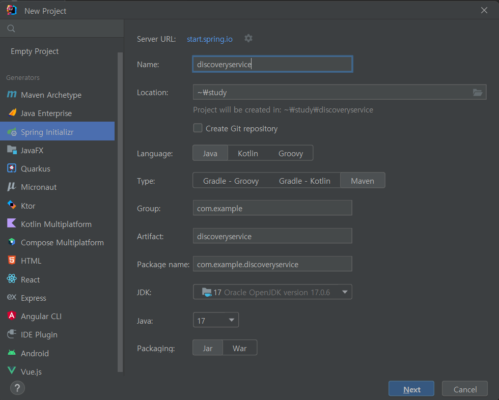
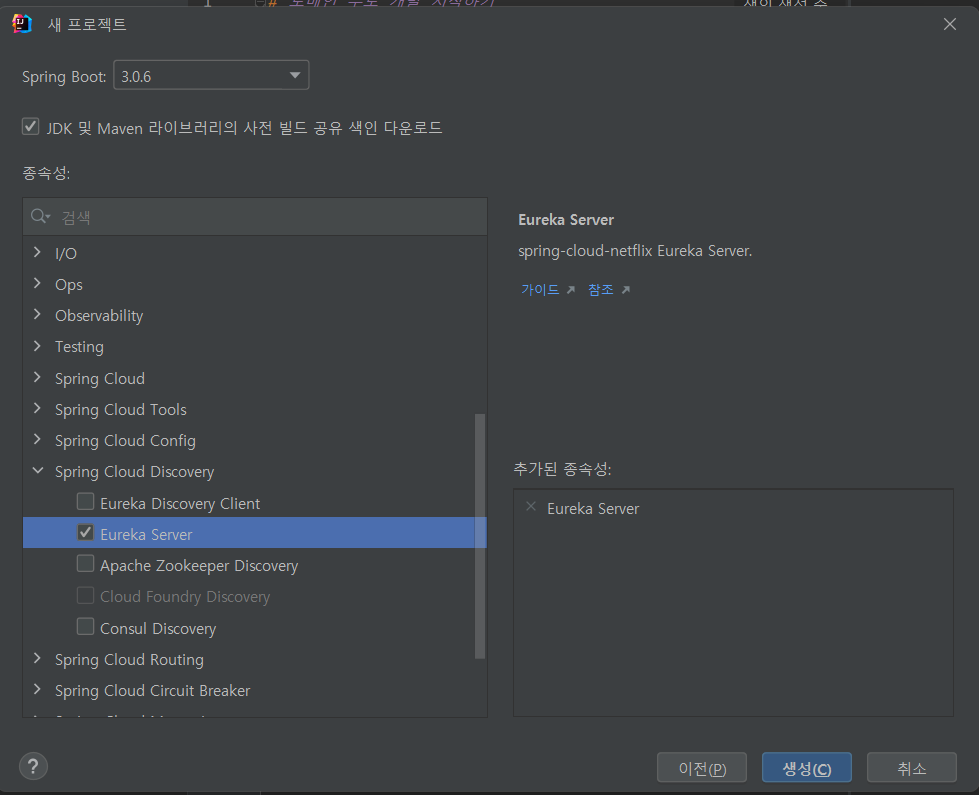
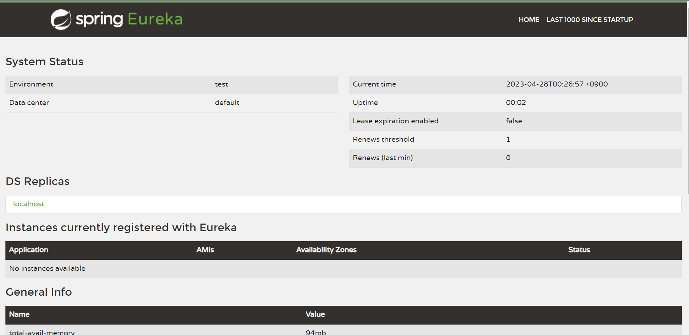
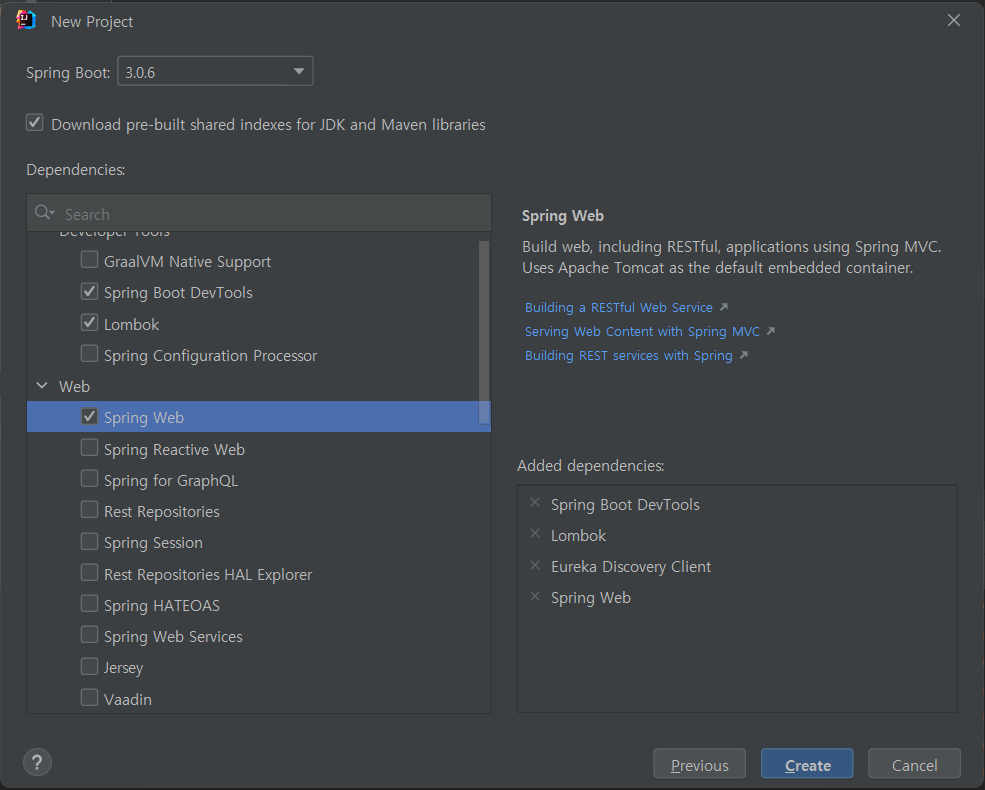
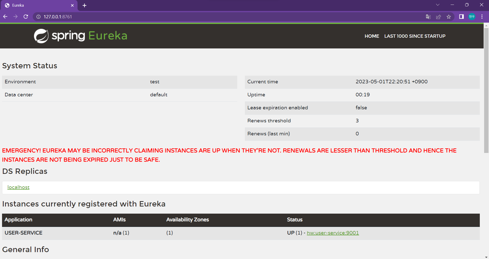
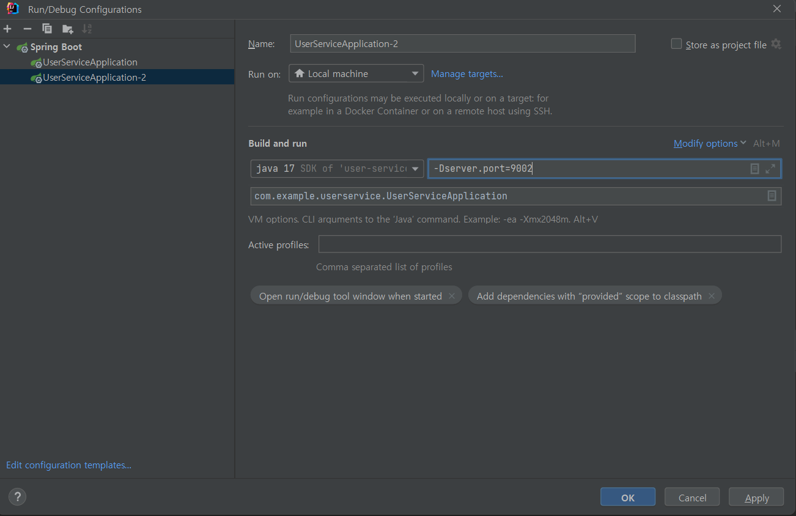
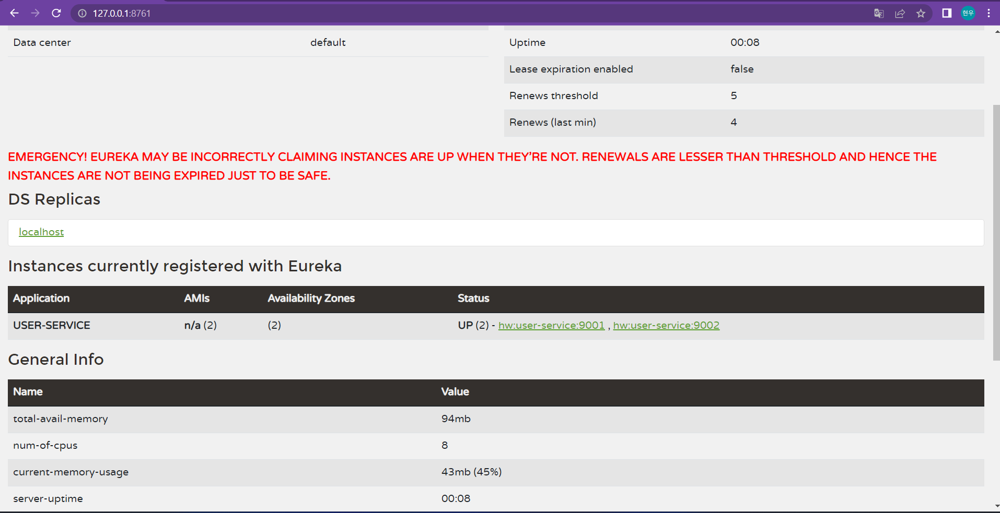
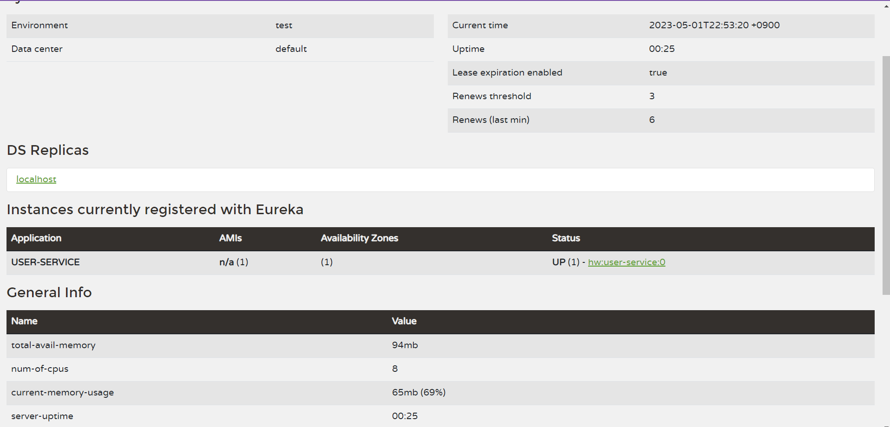
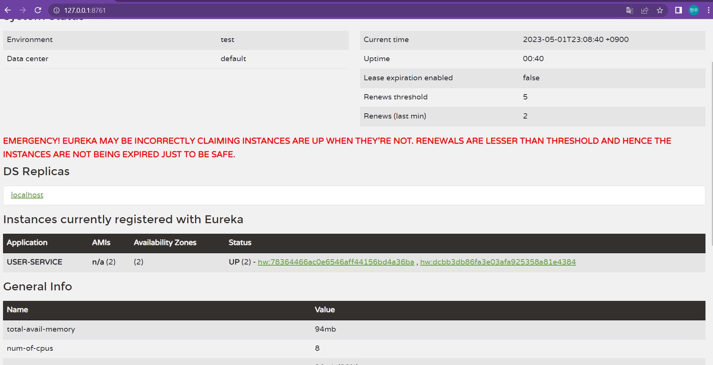

# Spring Cloud Netflix Eureka

하나의 PC에서 여러 개의 서비스를 동시에 실행하기 위해선 포트를 분산시켜서 실행시켜야 한다.

| 서비스                | url                   |
|--------------------|-----------------------|
| SERVICE INSTANCE **A** | http://**localhost:8080** |
| SERVICE INSTANCE **B** | http://**localhost:8081** |
| SERVICE INSTANCE **C** | http://**localhost:8082** |

만약 PC가 한 대 이상일 때는 IP가 다르기 때문에 포트는 동일하게 실행해도 된다.

| 서비스                    | url                    |
|------------------------|------------------------|
| SERVICE INSTANCE **A** | http://**my-server1:8080** |
| SERVICE INSTANCE **B** | http://**my-server2:8080** |
| SERVICE INSTANCE **C** | http://**my-server3:8080** |

- **Eureka**가 해주는 역할을 **Service Discovery**라고 한다.
- **Service** **Discovery**는 외부에서 다른 서비스들이 마이크로서비스들을 검색하기 위해서 사용되는 개념이다.

**동작 방식**

1. 각각의 마이크로서비스들의 위치 정보를 `Spring Cloud Netflix Eureka`에 등록을 해준다.
2. 등록된 마이크로서비스를 사용하고 싶은 Client는 자신이 필요한 요청정보를 `Load Balancer(API Gateway)`에 전달한다.
3. 요청 정보는 `Service Discovery`에 전달이 되서 필요한 정보에 맞는 마이크로서비스의 위치 정보를 반환한다.
4. 마이크로서비스의 위치 정보를 받은 `Load Balancer`는 해당 마이크로서비스에 요청 정보를 전달해 필요한 정보를 반환받는다.

## 프로젝트 생성





*pom.xml*

```xml
<?xml version="1.0" encoding="UTF-8"?>
<project xmlns="http://maven.apache.org/POM/4.0.0" xmlns:xsi="http://www.w3.org/2001/XMLSchema-instance"
         xsi:schemaLocation="http://maven.apache.org/POM/4.0.0 https://maven.apache.org/xsd/maven-4.0.0.xsd">
    <modelVersion>4.0.0</modelVersion>
    <parent>
        <groupId>org.springframework.boot</groupId>
        <artifactId>spring-boot-starter-parent</artifactId>
        <version>3.0.6</version>
        <relativePath/> <!-- lookup parent from repository -->
    </parent>
    <groupId>com.example</groupId>
    <artifactId>discoveryservice</artifactId>
    <version>0.0.1-SNAPSHOT</version>
    <name>discoveryservice</name>
    <description>discoveryservice</description>
    <properties>
        <java.version>17</java.version>
        <spring-cloud.version>2022.0.2</spring-cloud.version>
    </properties>
    <dependencies>
        <dependency>
            <groupId>org.springframework.cloud</groupId>
            <artifactId>spring-cloud-starter-netflix-eureka-server</artifactId>
        </dependency>

        <dependency>
            <groupId>org.springframework.boot</groupId>
            <artifactId>spring-boot-starter-test</artifactId>
            <scope>test</scope>
        </dependency>
    </dependencies>
    <dependencyManagement>
        <dependencies>
            <dependency>
                <groupId>org.springframework.cloud</groupId>
                <artifactId>spring-cloud-dependencies</artifactId>
                <version>${spring-cloud.version}</version>
                <type>pom</type>
                <scope>import</scope>
            </dependency>
        </dependencies>
    </dependencyManagement>

    <build>
        <plugins>
            <plugin>
                <groupId>org.springframework.boot</groupId>
                <artifactId>spring-boot-maven-plugin</artifactId>
            </plugin>
        </plugins>
    </build>
    <repositories>
        <repository>
            <id>netflix-candidates</id>
            <name>Netflix Candidates</name>
            <url>https://artifactory-oss.prod.netflix.net/artifactory/maven-oss-candidates</url>
            <snapshots>
                <enabled>false</enabled>
            </snapshots>
        </repository>
    </repositories>

</project>
```

- pom.xml을 확인해보면 spring cloud의 dependency를 추가되어 있는 것을 확인할 수 있다.

*application.yml*

```yaml
#Eureka Server의 Port
server:
  port: 8761

#마이크로서비스 어플리케이션의 고유 이름
spring:
  application:
    name: discoveryservice

#Eureka 라이브러리를 포함한채 스프링 부트가 기동이 되면
#기본적으로 Eureka Client 입장으로 어딘가 등록하게 된다.
#필요없는 행위이기에 값을 false로 설정해줘야 한다.
eureka:
  client:
    register-with-eureka: false #default: true
    fetch-registry: false       #default: true
```

*DiscoveryserviceApplication.java*

```java
package com.example.discoveryservice;

import org.springframework.boot.SpringApplication;
import org.springframework.boot.autoconfigure.SpringBootApplication;
import org.springframework.cloud.netflix.eureka.server.EnableEurekaServer;

@SpringBootApplication
@EnableEurekaServer
public class DiscoveryserviceApplication {

    public static void main(String[] args) {
        SpringApplication.run(DiscoveryserviceApplication.class, args);
    }

}
```

- `@EnableEurekaServer`어노테이션을 추가해준다.

*실행* [http://127.0.0.1:8761](http://127.0.0.1:8761/)



유레카 서버를 실행중인게 확인이 된다.

# User Service - 프로젝트 생성




- User Service로 Eureka Discovery Client를 선택해주고 추가적으로 개발에 필요한 dependency를 선택해준다.

*UserServiceApplication.java*

```java
package com.example.userservice;

import org.springframework.boot.SpringApplication;
import org.springframework.boot.autoconfigure.SpringBootApplication;
import org.springframework.cloud.client.discovery.EnableDiscoveryClient;

@SpringBootApplication
@EnableDiscoveryClient
public class UserServiceApplication {

    public static void main(String[] args) {
        SpringApplication.run(UserServiceApplication.class, args);
    }

}
```

- `@EnableDiscoveryClient`어노테이션을 추가해준다.

*application.yml*

```yaml
server:
  port: 9001

spring:
  application:
    name: user-service

eureka:
  client:
    register-with-eureka: true
    #아래의 코드는 EUREKA서버로부터 인스턴스들의 정보를 주기적으로 가져올 것인지를 설정하는 속성입니다.
    #true로 설정하면, 갱신 된 정보를 받겠다는 설정입니다.
    fetch-registry: true
    #service-url이란 항목은 해당 프로젝트는 eureka server에 등록될 eureka client의 역할을 하는데,
    #서버에 등록을 하기위해 서버의 위치가 어딘지 지정해주는 항목이다.
    service-url:
      defaultZone: http://127.0.0.1:8761/eureka
```

- application name을 `user-service`로 지정해주고
- 서버의 위치를 지정해준다.

*실행* [http://127.0.0.1:8761](http://127.0.0.1:8761/)



- 화면 아래에 `USER-SERVICE`서비스가 실행중인걸 확인할 수 있다.

# User Service - 등록



- -D 옵션은 자바에서 클래스를 실행할 때 부가적인 파라미터를 추가할 때 사용하는 옵션이다.
- `-Dserver.port=9002`코드는 클래스 실행 시 서버의 포트를 9002로 지정하겠다는 의미이다.



- `USER-SERVICE`서비스가 2개 실행중인걸 확인할 수 있다.

**mvn 안깔려 있으므로 생략**

*인텔리제이 터미널에서도 서버를 실행할 수 있다.*

```bash
mvn spring-boot:run -Dspring-boot.run.jvmArguments='-Dserver.prot=9003'
```

*shell에서 따로 서버를 실행*

```bash
#user-service 경로로 이동
cd user-service

mvn clean

mvn complie package

java -jar -Dserver.prot=9004 ./target/user-service-0.0.1-SNAPSHOT.jar
```

# User Service - Load Balancer

위에서는 일일이 port번호를 지정하여 서버를 실행해줬는데 random port를 이용하여 서버를 실행하여보자.

*application.yml*

```yaml
server:
  port: 0 #0이라는 값을 넣으면 random으로 port를 지정해준다.

...
```


- port를 random으로 알아서 지정되어 실행되는걸 확인할 수 있다.



> 그런데 random port를 사용하여 서버를 2개 이상 실행시 위와 같이 하나의 서버만 실행되는 것처럼 보이게 된다. 왜 이런 현상이 생기냐면 Status 쪽에 표시되는 이름의 방식 때문에 그렇다.
표시되는 방식은 `현재 작동중인 호스트 ip address (hw)`, `서비스 name (user-service)`, `application.yml파일에 지정된 port (0)`가 표시되게 된다. 그렇기 때문에 위의 방식대로 서버 몇 개를 실행하든 하나로만 표시되게 된다.

따라서 몇 개의 추가 정보를 입력해 해결할 수 있다.
>

*application.yml*

```yaml
...

eureka:
  instance:
    instance-id: ${spring.cloud.client.hostname}:${spring.application.instance_id:${random.value}}
  ...
```

*실행*



- 인스턴스 아이디를 지정후 서버를 2개 실행하게 되면 위와 같이 2개의 서비스가 실행중인걸 확인할 수 있다.