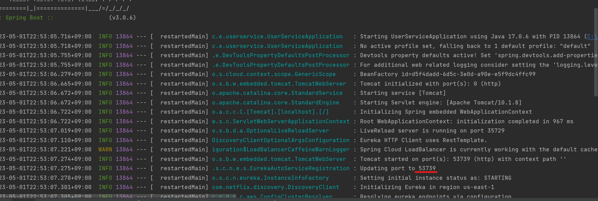
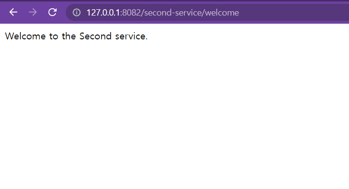
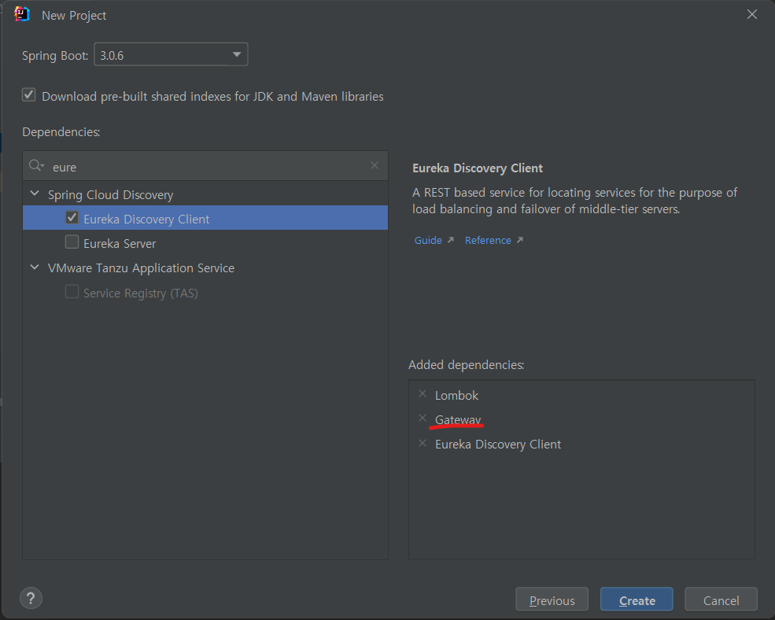

# Spring Cloud Netflix Eureka

하나의 PC에서 여러 개의 서비스를 동시에 실행하기 위해선 포트를 분산시켜서 실행시켜야 한다.

| 서비스                | url                   |
|--------------------|-----------------------|
| SERVICE INSTANCE **A** | http://**localhost:8080** |
| SERVICE INSTANCE **B** | http://**localhost:8081** |
| SERVICE INSTANCE **C** | http://**localhost:8082** |

만약 PC가 한 대 이상일 때는 IP가 다르기 때문에 포트는 동일하게 실행해도 된다.

| 서비스                    | url                    |
|------------------------|------------------------|
| SERVICE INSTANCE **A** | http://**my-server1:8080** |
| SERVICE INSTANCE **B** | http://**my-server2:8080** |
| SERVICE INSTANCE **C** | http://**my-server3:8080** |

- **Eureka**가 해주는 역할을 **Service Discovery**라고 한다.
- **Service** **Discovery**는 외부에서 다른 서비스들이 마이크로서비스들을 검색하기 위해서 사용되는 개념이다.

**동작 방식**


(서비스 실행시)각각의 마이크로서비스들의 위치 정보를 `Spring Cloud Netflix Eureka`에 등록을 해준다.

1. 등록된 마이크로서비스를 사용하고 싶은 `Client`는 자신이 필요한 요청정보를 `Load Balancer(API Gateway)`에 전달한다.
2. 요청 정보는 `Service Discovery`에 전달이 되서 필요한 정보에 맞는 `마이크로서비스`의 위치 정보를 반환한다.
3. `마이크로서비스`의 위치 정보를 받은 `Load Balancer`는 해당 `마이크로서비스`에 요청 정보를 전달한다.
4. 요청 정보를 받은 `마이크로서비스`가 요청 정보에 맞게 프로세스를 처리한다.
5. 응답 정보를 `Load Balancer`에게 반환한다.
6. `Client`에게 응답정보를 반환한다.

## 프로젝트 생성


*pom.xml*

```xml
<?xml version="1.0" encoding="UTF-8"?>
<project xmlns="http://maven.apache.org/POM/4.0.0" xmlns:xsi="http://www.w3.org/2001/XMLSchema-instance"
         xsi:schemaLocation="http://maven.apache.org/POM/4.0.0 https://maven.apache.org/xsd/maven-4.0.0.xsd">
    <modelVersion>4.0.0</modelVersion>
    <parent>
        <groupId>org.springframework.boot</groupId>
        <artifactId>spring-boot-starter-parent</artifactId>
        <version>3.0.6</version>
        <relativePath/> <!-- lookup parent from repository -->
    </parent>
    <groupId>com.example</groupId>
    <artifactId>discoveryservice</artifactId>
    <version>0.0.1-SNAPSHOT</version>
    <name>discoveryservice</name>
    <description>discoveryservice</description>
    <properties>
        <java.version>17</java.version>
        <spring-cloud.version>2022.0.2</spring-cloud.version>
    </properties>
    <dependencies>
        <dependency>
            <groupId>org.springframework.cloud</groupId>
            <artifactId>spring-cloud-starter-netflix-eureka-server</artifactId>
        </dependency>

        <dependency>
            <groupId>org.springframework.boot</groupId>
            <artifactId>spring-boot-starter-test</artifactId>
            <scope>test</scope>
        </dependency>
    </dependencies>
    <dependencyManagement>
        <dependencies>
            <dependency>
                <groupId>org.springframework.cloud</groupId>
                <artifactId>spring-cloud-dependencies</artifactId>
                <version>${spring-cloud.version}</version>
                <type>pom</type>
                <scope>import</scope>
            </dependency>
        </dependencies>
    </dependencyManagement>

    <build>
        <plugins>
            <plugin>
                <groupId>org.springframework.boot</groupId>
                <artifactId>spring-boot-maven-plugin</artifactId>
            </plugin>
        </plugins>
    </build>
    <repositories>
        <repository>
            <id>netflix-candidates</id>
            <name>Netflix Candidates</name>
            <url>https://artifactory-oss.prod.netflix.net/artifactory/maven-oss-candidates</url>
            <snapshots>
                <enabled>false</enabled>
            </snapshots>
        </repository>
    </repositories>

</project>
```

- pom.xml을 확인해보면 spring cloud의 dependency를 추가되어 있는 것을 확인할 수 있다.

*application.yml*

```yaml
#Eureka Server의 Port
server:
  port: 8761

#마이크로서비스 어플리케이션의 고유 이름
spring:
  application:
    name: discoveryservice

#Eureka 라이브러리를 포함한채 스프링 부트가 기동이 되면
#기본적으로 Eureka Client 입장으로 어딘가 등록하게 된다.
#필요없는 행위이기에 값을 false로 설정해줘야 한다.
eureka:
  client:
    register-with-eureka: false #default: true
    fetch-registry: false       #default: true
```

*DiscoveryserviceApplication.java*

```java
package com.example.discoveryservice;

import org.springframework.boot.SpringApplication;
import org.springframework.boot.autoconfigure.SpringBootApplication;
import org.springframework.cloud.netflix.eureka.server.EnableEurekaServer;

@SpringBootApplication
@EnableEurekaServer
public class DiscoveryserviceApplication {

    public static void main(String[] args) {
        SpringApplication.run(DiscoveryserviceApplication.class, args);
    }

}
```

- `@EnableEurekaServer`어노테이션을 추가해준다.

*실행* [http://127.0.0.1:8761](http://127.0.0.1:8761/)


유레카 서버를 실행중인게 확인이 된다.

# User Service - 프로젝트 생성


- User Service로 Eureka Discovery Client를 선택해주고 추가적으로 개발에 필요한 dependency를 선택해준다.

*UserServiceApplication.java*

```java
package com.example.userservice;

import org.springframework.boot.SpringApplication;
import org.springframework.boot.autoconfigure.SpringBootApplication;
import org.springframework.cloud.client.discovery.EnableDiscoveryClient;

@SpringBootApplication
@EnableDiscoveryClient
public class UserServiceApplication {

    public static void main(String[] args) {
        SpringApplication.run(UserServiceApplication.class, args);
    }

}
```

- `@EnableDiscoveryClient`어노테이션을 추가해준다.

*application.yml*

```yaml
server:
  port: 9001

spring:
  application:
    name: user-service

eureka:
  client:
    register-with-eureka: true
    #아래의 코드는 EUREKA서버로부터 인스턴스들의 정보를 주기적으로 가져올 것인지를 설정하는 속성입니다.
    #true로 설정하면, 갱신 된 정보를 받겠다는 설정입니다.
    fetch-registry: true
    #service-url이란 항목은 해당 프로젝트는 eureka server에 등록될 eureka client의 역할을 하는데,
    #서버에 등록을 하기위해 서버의 위치가 어딘지 지정해주는 항목이다.
    service-url:
      defaultZone: http://127.0.0.1:8761/eureka
```

- application name을 `user-service`로 지정해주고
- 서버의 위치를 지정해준다.

*실행* [http://127.0.0.1:8761](http://127.0.0.1:8761/)


- 화면 아래에 `USER-SERVICE`서비스가 실행중인걸 확인할 수 있다.

# User Service - 등록


- -D 옵션은 자바에서 클래스를 실행할 때 부가적인 파라미터를 추가할 때 사용하는 옵션이다.
- `-Dserver.port=9002`코드는 클래스 실행 시 서버의 포트를 9002로 지정하겠다는 의미이다.


- `USER-SERVICE`서비스가 2개 실행중인걸 확인할 수 있다.

**mvn 안깔려 있으므로 생략**

*인텔리제이 터미널에서도 서버를 실행할 수 있다.*

```bash
mvn spring-boot:run -Dspring-boot.run.jvmArguments='-Dserver.prot=9003'
```

*shell에서 따로 서버를 실행*

```bash
#user-service 경로로 이동
cd user-service

mvn clean

mvn complie package

java -jar -Dserver.prot=9004 ./target/user-service-0.0.1-SNAPSHOT.jar
```

# User Service - Load Balancer

위에서는 일일이 port번호를 지정하여 서버를 실행해줬는데 random port를 이용하여 서버를 실행하여보자.

*application.yml*

```yaml
server:
  port: 0 #0이라는 값을 넣으면 random으로 port를 지정해준다.

...
```



- port를 random으로 알아서 지정되어 실행되는걸 확인할 수 있다.


> 그런데 random port를 사용하여 서버를 2개 이상 실행시 위와 같이 하나의 서버만 실행되는 것처럼 보이게 된다. 왜 이런 현상이 생기냐면 Status 쪽에 표시되는 이름의 방식 때문에 그렇다.
표시되는 방식은 `현재 작동중인 호스트 ip address (hw)`, `서비스 name (user-service)`, `application.yml파일에 지정된 port (0)`가 표시되게 된다. 그렇기 때문에 위의 방식대로 서버 몇 개를 실행하든 하나로만 표시되게 된다.

따라서 몇 개의 추가 정보를 입력해 해결할 수 있다.
>

*application.yml*

```yaml
...

eureka:
  instance:
    instance-id: ${spring.cloud.client.hostname}:${spring.application.instance_id:${random.value}}
  ...
```

*실행*


- 인스턴스 아이디를 지정후 서버를 2개 실행하게 되면 위와 같이 2개의 서비스가 실행중인걸 확인할 수 있다.

# API Gateway Service


**클라이언트-마이크로서비스 간 직접 통신 대신 API Gateway를 고려하는 이유**

마이크로서비스 아키텍처에서 클라이언트 앱은 일반적으로 둘 이상의 마이크로서비스에서 제공하는 기능을 사용해야 한다. 해당 사용이 직접 실행되는 경우 클라이언트는 마이크로서비스 엔드포인트에 대한 여러 호출을 처리해야 한다. 애플리케이션이 개선되고 새 마이크로서비스가 도입되었거나 기존 마이크로서비스가 업데이트되면 어떻게 해야하나? 애플리케이션에 여러 마이크로서비스가 있는 경우 클라이언트 앱에서 많은 엔드포인트를 처리하는 것은 큰 문제일 수 있다. 클라이언트 앱은 해당 내부 엔드 포인트에 결합되므로 나중에 마이크로서비스가 개선되면 클라이언트 앱에 큰 영향을 줄 수 있다.

따라서 중간 수준 또는 간접 참조 계층(Gateway)을 포함하면 마이크로서비스 기반 애플리케이션의 경우 편리해진다. API Gateway가 없는 경우 클라이언트 앱은 마이크로서비스로 직접 요청을 보내야 하는데 이경우 다음과 같은 문제가 발생한다.

- 결합: **API Gateway 패턴**이 없으면 클라이언트 앱은 내부 마이크로서비스에 결합된다. 클라이언트 앱은 애플리케이션의 여러 영역이 마이크로서비스에서 어떻게 분해되는지 알아야 한다. 내부 마이크로서비스를 개선하고 리팩터링할 경우 클라이언트 앱에서 내부 마이크로서비스를 직접 참조하기 때문에 클라이언트 앱에 호환성이 손상되는 변경이 발생하므로 해당 작업은 유지관리에 영향을 준다. 클라이언트 앱을 자주 업데이트해야 하므로 솔루션을 개선하기가 더 어려워진다.
- 너무 많은 왕복: 클라이언트 앱의 단일 페이지/화면에서 여러 서비스를 몇 번 호출해야 할 수 있다. 해당 접근 방식으로 인해 클라이언트와 서버 간에 여러 번의 네트워크 왕복이 발생할 수 있어 대기 시간이 상당히 늘어난다. 중간 수준에서 처리되는 집계는 클라이언트 앱의 성능과 사용자 환경을 향상할 수 있다.
- 보안 문제: Gateway가 없으면 모든 마이크로서비스가 “외부 세계”에 노출되어야 하므로 클라이언트 앱에서 직접 사용되지 않는 내부 마이크로서비스를 숨길 경우보다 더 큰 공격 표면이 생성된다. 공격 표면이 작을수록 애플리케이션을 더 안전하게 보호할 수 있다.
- 교차 편집 문제: 공개적으로 게시된 각 마이크로서비스는 권한 부여 및 SSL과 같은 문제를 처리해야 한다. 대부분의 경우 이러한 문제는 단일 계층에서 처리할 수 있으므로 내부 마이크로서비스가 간소화 된다.

**API Gateway Service 사용시 가능한 기능들**

- 인증 및 권한 부여
- 서비스 검색 통합
- 응답 캐싱
- 정책, 회로 차단기 및 QoS 다시 시도
- 속도 제한
- 부하 분산
- 로깅, 추적, 상관관계
- 헤더, 쿼리 문자열 및 청구 변환
- IP 허용 목록에 추가

# Spring Cloud Gateway

## 프로젝트 생성

### first-service 프로젝트 생성


*FirstServiceController.java*

```java
package com.example.firstservice;

import org.springframework.web.bind.annotation.GetMapping;
import org.springframework.web.bind.annotation.RequestMapping;
import org.springframework.web.bind.annotation.RestController;

@RestController
@RequestMapping("/first-service")
public class FirstServiceController {
    @GetMapping("/welcome")
    public String welcome() {
        return "Welcome to the First service.";
    }
}
```

*application.yml*

```yaml
server:
  port: 8081

spring:
  application:
    name: my-first-service

eureka:
  client:
    register-with-eureka: false
    fetch-registry: false
```

*실행*


- 해당 **8081** **port**로 접속해서 기대했던 화면이 표시된다.

### second-service 프로젝트 생성


*SecondServiceController.java*

```java
package com.example.secondservice;

import org.springframework.web.bind.annotation.GetMapping;
import org.springframework.web.bind.annotation.RequestMapping;
import org.springframework.web.bind.annotation.RestController;

@RestController
@RequestMapping("/second-service")
public class SecondServiceController {
    @GetMapping("/welcome")
    public String welcome() {
        return "Welcome to the Second service.";
    }
}
```

*application.yml*

```yaml
server:
  port: 8082

spring:
  application:
    name: my-second-service

eureka:
  client:
    register-with-eureka: false
    fetch-registry: false
```

*실행*



- first-service와 같이 지정해놓은 **8082 port**로 접속하여 기대했던 화면이 표시된걸 확인할 수 있다.

### api gateway-service 프로젝트 생성




- Spring Cloud Routing의 Gateway를 선택해주어야 한다.

*application.yml*

```yaml
server:
  port: 8000

eureka:
  client:
    register-with-eureka: false
    fetch-registry: false
    service-url:
      defaultZone: http://localhost:8761/eureka

spring:
  application:
    name: apigateway-service
  cloud:
    gateway:
      routes:
        - id: first-service
          uri: http://localhost:8081/
          predicates:
            - Path=/first-service/**
        - id: second-service
          uri: http://localhost:8082/
          predicates:
            - Path=/second-service/**

```

*gateway 실행*


- api gateway-service의 **port 8000**으로 접속했는데 first-service와 second-service에 요청되는걸 확인할 수 있다.

# Users Microservice - Security

- **Spring Security**
    - **Authentication + Authorization**

*Spring Security 연동 과정*

1. 애플리케이션에 `spring **security** jar`을 Dependency에 추가
2. `**WebSecurityConfigurerAdapter**`를 상속받는 `Security **Configuration`** 클래스 생성
3. `Security Configuration` 클래스에 `**@EnableWebSecurity**`추가
4. **Authentication → `configure(AuthenticationManagerBuilder auth)`** 메서드를 재정의
5. Password encode를 위한 `**BCryptPasswordEncoder**` 빈 정의
6. **Authorization → `configure(HttpSecurity http)`** 메서드를 재정의

***Dependency 추가***

```xml
<dependency>
    <groupId>org.springframework.boot</groupId>
    <artifactId>spring-boot-starter-security</artifactId>
</dependency>
```

***WebSecurity class***

```java
package com.example.userservice.security;

import org.springframework.context.annotation.Configuration;
import org.springframework.security.config.annotation.web.builders.HttpSecurity;
import org.springframework.security.config.annotation.web.configuration.EnableWebSecurity;
import org.springframework.security.config.annotation.web.configuration.WebSecurityConfigurerAdapter;

@Configuration
@EnableWebSecurity
public class WebSecurity extends WebSecurityConfigurerAdapter {

    @Override
    protected void configure(HttpSecurity http) throws Exception {
        http.csrf().disable();
        http.authorizeRequests().antMatchers("/users/**").permitAll();

				http.headers().frameOptions().disable();
    }
}
```

- `http.csrf().disable();`
    - CSRF란 Cross site Request forgery로 **사이트 간 요청 위조**라는 의미로 웹 어플리케이션의 취약점 중 하나로, 이용자가 의도하지 않은 요청을 통한 공격을 의미한다. 즉 **CSRF 공격이란, 인터넷 사용자(희생자)가 자신의 의지와는 무관하게 공격자가 의도한 행위(등록, 수정, 삭제 등)를 특정 웹사이트에 요청하도록 만드는 공격**이다.
    - 스프링에서는 기본적으로 csrf의 공격에 대해 보안을 하는데 해당 기능을 왜 disable 하는 것일까
      이유는 Rest API를 이용한 서버라면, session 기반 인증과는 다르게 stateless하기 때문에 서버에 인증정보를 보관하지 않는다. Reqt API에서 client는 권한이 필요한 요청을 하기 위해서는 요청에 필요한 인증 정보를(Oauth2, jwt토큰 등)을 포함시켜야 한다. 따라서 서버에 인증정보를 저장하지 않기 때문에 굳이 불필요한 csrf 코드들을 작성할 필요가 없다.
- `http.authorizeRequests().antMatchers("/users/**").permitAll();`
    - {domain}/users/** 로 요청들은 인증 작업없이 허용하겠다는 의미를 가진다.
    - ex1) http://localhost:8081/users
    - ex2) http://localhost:8081/users/1

> 참고: `Spring Security` library를 추가하게 되면 서버를 실행시
`Using generated security password: {특정 암호키}`
이런식의 로그가 찍히게 된다.
현재로서 사용할 일은 없지만 나중에 프로젝트에서 특별하게 인증작업을 암호와 아이디를 사용하지 않을때 해당 인증키를 사용하여 인증을 할 수 있다.
>

*http.headers().frameOptions().disable();*

http://localhost:{port}/h2-console 해당 url로 요청시


이렇게 h2 콘솔 창이 표시되고 **Connect**버튼을 클릭시


이렇게 프레임별로 나눠지고 깨진 화면이 표시된다.

원인은 h2-console의 html에 프레임별로 데이터가 나누어져 있어서 그렇다. 그래서 `http.headers().frameOptions().disable();`을 해주면 h2 콘솔창이 잘 표시된다.


***BCryptPasswordEncoder***

**Bean 등록**

*UserServiceApplication.java*

```java
@SpringBootApplication
@EnableDiscoveryClient
public class UserServiceApplication {

    public static void main(String[] args) {
        SpringApplication.run(UserServiceApplication.class, args);
    }

    @Bean
    public BCryptPasswordEncoder passwordEncoder() {
        return new BCryptPasswordEncoder();
    }
}
```

이런식으로 `UserServiceApplication.java`에 빈을 등록해야 서버가 실행될 때 딱 한 번만 객체를 생성해서 Bean으로 관리할 수 있다.

*UserServiceImpl.java*

```java
package com.example.userservice.service;

import com.example.userservice.dto.UserDto;
import com.example.userservice.jpa.UserEntity;
import com.example.userservice.jpa.UserRepository;
import lombok.RequiredArgsConstructor;
import org.modelmapper.ModelMapper;
import org.modelmapper.convention.MatchingStrategies;
import org.springframework.security.crypto.bcrypt.BCryptPasswordEncoder;
import org.springframework.stereotype.Service;

import java.util.UUID;

@Service
@RequiredArgsConstructor
public class UserServiceImpl implements UserService {
    private final UserRepository userRepository;
    private final BCryptPasswordEncoder passwordEncoder;

    @Override
    public UserDto createUser(UserDto userDto) {
        userDto.setUserId(UUID.randomUUID().toString());

        ModelMapper mapper = new ModelMapper();
        mapper.getConfiguration().setMatchingStrategy(MatchingStrategies.STRICT);
        userDto.setEncryptPwd(passwordEncoder.encode(userDto.getPwd()));
        UserEntity userEntity = mapper.map(userDto, UserEntity.class);

        userRepository.save(userEntity);

        UserDto returnUserDto = mapper.map(userEntity, UserDto.class);

        return returnUserDto;
    }
}
```

`userDto.setEncryptPwd(passwordEncoder.encode(userDto.getPwd()));` 이렇게 `BCryptPasswordEncode`를 사용해서 password를 encode할 수 있다.